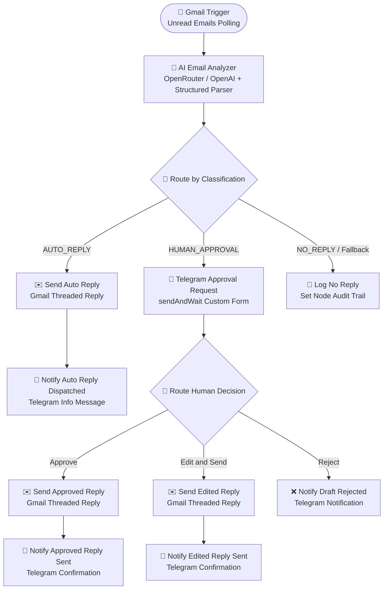

# AI-Powered Email Triage & Telegram Human-in-the-Loop Automation

An intelligent, production-ready n8n automation workflow that monitors incoming Gmail messages, performs AI analysis and response drafting, automatically replies to safe routine inquiries within the original conversation thread, and routes sensitive/commercial inquiries to an interactive Telegram approval interface featuring **Approve**, **Edit & Send**, and **Reject** capabilities.

Two ready-to-use editions are available in your n8n workspace:
1. **OpenAI Edition (GPT-5)**: Built for native OpenAI API keys.
2. **OpenRouter Edition**: Ideal for testing without an OpenAI account (supports `openai/gpt-4o-mini`, Claude, Gemini, DeepSeek, and free tier models).

---

## 📑 Table of Contents

- [Architecture & Workflow Flowchart](#-architecture--workflow-flowchart)
- [Workflow Editions in n8n](#-workflow-editions-in-n8n)
- [Workflow Capabilities](#-workflow-capabilities)
- [Mandatory Human Approval Rules](#-mandatory-human-approval-rules)
- [🐳 Running n8n Locally with Docker](#-running-n8n-locally-with-docker)
- [Prerequisites & Credentials Setup](#-prerequisites--credentials-setup)
  - [1. Gmail Integration (OAuth2)](#1-gmail-integration-oauth2)
  - [2. OpenRouter API Integration (Recommended for Immediate Testing)](#2-openrouter-api-integration-recommended-for-immediate-testing)
  - [3. OpenAI API Integration (GPT-5)](#3-openai-api-integration-gpt-5)
  - [4. Telegram Bot & Chat Setup](#4-telegram-bot--chat-setup)
- [Node-by-Node Breakdown](#-node-by-node-breakdown)
- [✏️ Customizing the AI System Prompt (Business Profile)](#️-customizing-the-ai-system-prompt-business-profile)
- [Step-by-Step Testing & Verification](#-step-by-step-testing--verification)
- [Files in this Repository](#-files-in-this-repository)
- [Production Deployment & Activation](#-production-deployment--activation)
- [☁️ n8n Cloud Production Setup Guide](#️-n8n-cloud-production-setup-guide)

---

## 🏗 Architecture & Workflow Flowchart



---

## ⚡ Workflow Editions in n8n

| Edition | Canvas URL | AI Model Node | Credential Required |
| :--- | :--- | :--- | :--- |
| **OpenRouter Edition** *(Ready for testing)* | [http://localhost:5678/workflow/4BLhCNcWSTJ1L5tj](http://localhost:5678/workflow/4BLhCNcWSTJ1L5tj) | `OpenRouter Chat Model` (`openai/gpt-4o-mini`, etc.) | `OpenRouter API` |
| **OpenAI GPT-5 Edition** | [http://localhost:5678/workflow/GMVu4yBBRYuYec8c](http://localhost:5678/workflow/GMVu4yBBRYuYec8c) | `OpenAI GPT-5 Model` (`gpt-5-mini`) | `OpenAI API` |

---

## 🚀 Workflow Capabilities

1. **Native Thread-Aware Gmail Integration**:
   - Fetches unread incoming emails with full body text, sender, subject, date, message ID, and thread ID.
   - All replies are threaded using Gmail's `reply` operation with the originating `messageId`, ensuring seamless conversation continuity in Gmail.

2. **AI Triage & Drafting**:
   - Classifies every message into:
     - `AUTO_REPLY`: Safe routine inquiries, standard FAQs, information acknowledgements.
     - `HUMAN_APPROVAL`: Inquiries requiring human review or meeting strict business criteria.
     - `NO_REPLY`: Newsletters, cold sales pitches, automated receipts, system alerts, bounces.
   - Assigns priority: `High`, `Medium`, or `Low`.
   - Generates an executive 1–2 sentence summary and concise reason for classification.
   - Pre-drafts a professional, context-aware email response.

3. **Interactive Telegram Human-in-the-Loop Review**:
   - Dispatches a formatted notification to Telegram with:
     - Sender details & Subject
     - Priority level & Approval Reason
     - Executive Summary
     - Full AI-generated response draft
   - Features a direct **"Review & Decide"** button that opens an n8n form interface:
     - **Approve**: Sends the AI draft as-is.
     - **Edit and Send**: Modifies the draft in an editable textarea before sending.
     - **Reject**: Cancels the response, prevents email dispatch, and records optional reviewer notes.

---

## 🛡 Mandatory Human Approval Rules

The workflow strictly enforces mandatory human approval. The AI agent will **never** auto-reply to emails involving any of the following:

| Topic | Criteria & Examples | Assigned Priority |
| :--- | :--- | :--- |
| **Pricing & Quotes** | Price inquiries, rate sheets, enterprise quotations, discount requests | `High` |
| **Contracts & Legal** | Agreements, NDAs, terms of service, SLA disputes, legal liabilities | `High` |
| **Refunds & Billing** | Refund demands, payment disputes, chargebacks, fee cancellations | `High` |
| **Complaints & Escalations** | Customer dissatisfaction, bug reports affecting business, escalations | `High` |
| **Commercial Negotiations** | Partnership discussions, vendor negotiations, custom commitments | `Medium` / `High` |
| **Deadlines & SLAs** | Time-critical commitments, delivery schedule promises | `Medium` / `High` |
| **Sensitive Information** | Account credentials, PII, financial info, proprietary data | `High` |
| **Important Client Comms** | Key accounts, executive inquiries, critical stakeholder messages | `Medium` / `High` |

---

## 🐳 Running n8n Locally with Docker

You can run n8n locally in Docker with persistent storage, pre-configured execution pruning, and local file access:

### 1. Start n8n
```bash
# Start container in detached mode
docker compose up -d
```

### 2. Check Logs & Status
```bash
# Follow logs
docker compose logs -f

# Check container status & health
docker compose ps
```

### 3. Access n8n UI
Open your browser and navigate to:
```
http://localhost:5678
```
- On first launch, follow the on-screen prompt to set up your local admin account.
- To import your workflow, go to **Workflows > Import from File** and select workflow_openrouter_export.json or workflow_export.json.

### 4. Stop or Restart
```bash
# Stop containers (keeps your workflows and credentials saved)
docker compose down

# Restart containers
docker compose restart
```

> [!TIP]
> **Testing Webhooks & Human-in-the-Loop from Telegram**:
> If you want Telegram callback buttons or incoming webhooks to reach your local n8n, expose your port with a tunnel tool (like `cloudflared` or `ngrok`):
> ```bash
> ngrok http 5678
> ```
> Then set `WEBHOOK_URL=https://your-domain.ngrok-free.app/` in your .env and restart with `docker compose up -d`.

---

## 🔑 Prerequisites & Credentials Setup

### 1. Gmail Integration (OAuth2)

1. Open the [Google Cloud Console](https://console.cloud.google.com/).
2. Create a project and enable the **Gmail API** under *APIs & Services > Library*.
3. Go to *APIs & Services > OAuth consent screen* (or *Audience*):
   - Set User Type to **External** (or Internal if using Google Workspace).
   - Fill in App name (e.g. `n8n Email Automation`) and your user support email.
   - Add scopes: `https://mail.google.com/` or `https://www.googleapis.com/auth/gmail.modify`.
   - **Crucial Step (Test Users)**: Scroll down to the **Test users** section, click **+ ADD USERS**, and add your Gmail address. Click **Save and Continue**.
4. Go to *APIs & Services > Credentials*:
   - Click **Create Credentials > OAuth client ID**.
   - Application type: **Web application**.
   - Authorized redirect URI: Copy the redirect URI shown in n8n when adding a Gmail OAuth2 credential (e.g. `http://localhost:5678/rest/oauth2-credential/callback`).
5. In n8n, open *Credentials > Add Credential > Gmail OAuth2*:
   - Enter **Client ID** and **Client Secret**.
   - Click **Sign in with Google**.
   - When you see *"Google hasn't verified this app"*, click **Advanced** → **Go to n8n Email Automation (unsafe)** → click **Continue** to grant permissions.

> [!WARNING]
> **Fixing "Error 403: access_denied - The app is currently being tested"**:
> If Google blocks login saying *"n8n has not completed the Google verification process"*:
> 1. Go to Google Cloud Console → **APIs & Services** → **OAuth consent screen** (or **Audience**).
> 2. Under **Test users**, click **ADD USERS**.
> 3. Enter your exact email address and click **Save**.
> 4. Retry the **Sign in with Google** button in n8n. Alternatively, you can click **PUBLISH APP** on the OAuth consent screen to move it out of Testing mode.

### 2. OpenRouter API Integration (Recommended for Immediate Testing)

1. Go to [OpenRouter.ai](https://openrouter.ai/keys) and generate an API key.
2. In n8n, open *Credentials > Add Credential > OpenRouter API*:
   - Paste your OpenRouter API Key.
   - Name the credential `OpenRouter API`.
3. In the OpenRouter workflow, the default model is set to `openai/gpt-4o-mini`. You can also switch it to any model supported by OpenRouter (e.g., `google/gemini-2.0-flash-001`, `meta-llama/llama-3.3-70b-instruct`, or free models).

### 3. OpenAI API Integration (GPT-5)

1. Go to the [OpenAI Platform](https://platform.openai.com/api-keys).
2. Create a new API Key with model access.
3. In n8n, open *Credentials > Add Credential > OpenAI*:
   - Paste your API key.
   - Name the credential `OpenAI API`.

### 4. Telegram Bot & Chat Setup

1. Open Telegram and search for [@BotFather](https://t.me/BotFather).
2. Send `/newbot`, choose a name and username (e.g. `MyEmailApprovalBot`).
3. BotFather will provide an **HTTP API Token** (e.g. `123456789:ABCDefghijk...`).
4. Start a chat with your new bot (press `/start`).
5. Retrieve your numeric Chat ID:
   - Search for [@get_id_bot](https://t.me/get_id_bot) or [@userinfobot](https://t.me/userinfobot) on Telegram and tap Start.
   - It will return your personal Chat ID (e.g. `987654321`).
6. In n8n:
   - Open *Credentials > Add Credential > Telegram API*.
   - Paste the Bot Access Token.
   - In the workflow nodes (`Notify Auto Reply Dispatched`, `Telegram Approval Request`, `Notify Approved Reply Sent`, `Notify Edited Reply Sent`, `Notify Draft Rejected`), set `Chat ID` to your numeric Chat ID.

---

## 🔍 Node-by-Node Breakdown

| Step | Node Name | Type | Purpose |
| :---: | :--- | :--- | :--- |
| **1** | `Gmail Trigger` | `n8n-nodes-base.gmailTrigger` | Polls unread emails every minute. Extracts `from`, `subject`, `date`, `snippet`, `text`, `threadId`, and `id`. |
| **2** | `AI Email Analyzer` | `@n8n/n8n-nodes-langchain.agent` | Analyzes incoming email with strict business prompts. |
| **2a** | `OpenRouter / OpenAI Model` | `lmChatOpenRouter` / `lmChatOpenAi` | Provides LLM inference (`gpt-4o-mini` on OpenRouter, `gpt-5-mini` on OpenAI). |
| **2b** | `Structured Output Parser` | `@n8n/n8n-nodes-langchain.outputParserStructured` | Subnode enforcing rigid JSON schema for classification & drafting. |
| **3** | `Route by Classification` | `n8n-nodes-base.switch` | 3-way router for `AUTO_REPLY`, `HUMAN_APPROVAL`, and `NO_REPLY`. Includes an IIFE safety guard that reclassifies `AUTO_REPLY` with empty `draft_response` to `NO_REPLY`. |
| **4a** | `Send Auto Reply` | `n8n-nodes-base.gmail` | Sends auto-reply directly into original thread using message ID. |
| **4b** | `Notify Auto Reply Dispatched` | `n8n-nodes-base.telegram` | Alerts team on Telegram that an auto-reply was sent. |
| **5a** | `Telegram Approval Request` | `n8n-nodes-base.telegram` | `sendAndWait` interactive form with Approve, Edit & Send, and Reject. |
| **5b** | `Route Human Decision` | `n8n-nodes-base.switch` | Routes execution based on reviewer's selection in form. |
| **6a** | `Send Approved Reply` | `n8n-nodes-base.gmail` | Replies to thread with AI-generated draft. |
| **6b** | `Notify Approved Reply Sent` | `n8n-nodes-base.telegram` | Sends Telegram confirmation that approved reply is out. |
| **7a** | `Send Edited Reply` | `n8n-nodes-base.gmail` | Replies to thread with the reviewer's edited text. |
| **7b** | `Notify Edited Reply Sent` | `n8n-nodes-base.telegram` | Sends Telegram confirmation with the final edited message. |
| **8** | `Notify Draft Rejected` | `n8n-nodes-base.telegram` | Notifies that draft was rejected and email was suppressed. |
| **9** | `Log No Reply` | `n8n-nodes-base.set` | Audit log record for ignored/marketing messages. |

---

## ✏️ Customizing the AI System Prompt (Business Profile)

The **AI Email Analyzer** node contains a system prompt with two sections you must personalize before going live: the **Business Profile** (who you are) and the **Response Drafting Rules** (how the AI should write on your behalf). Everything else — the classification logic, mandatory approval rules, and validation checklist — should be left unchanged.

### Where to Find the System Prompt

**In n8n (local or cloud):**
1. Open the workflow canvas.
2. Click the **`AI Email Analyzer`** node.
3. In the node settings panel, scroll down to **Options**.
4. Click on **System Message** — the full prompt text is in this field.
5. Edit directly in the text box, then click anywhere outside to confirm, and **Save** the workflow.

**In the JSON export files** (`workflow_export.json` / `workflow_openrouter_export.json`):
- The system prompt is at: `nodes[1].parameters.options.systemMessage`

---

### Section 1 — Business Profile & Knowledge Base

This is the factual knowledge the AI uses to answer emails on your behalf. Replace every field with your own real information.

```
BUSINESS PROFILE & KNOWLEDGE BASE:
- Organization / Company: Atik Automation
- Office Hours: Monday to Friday, 9:00 AM – 6:00 PM (GMT+6) (Closed on Saturday and Sunday)
- Physical Location / Office Address: Dhaka, Bangladesh (Our team also operates globally and remotely)
- Contact Email: support@atikautomation.com
- Services: AI workflow automation, email management systems, and technical consulting
- Default Sign-off / Signature:
Best regards,
Atik & The Automation Team
```

#### Field-by-Field Guide

| Field | What to Write | Example |
| :--- | :--- | :--- |
| **Organization / Company** | Your legal business name or brand name | `Acme Corp` / `Sarah's Design Studio` |
| **Office Hours** | Exact working days, times, and timezone | `Mon–Fri, 9 AM–5 PM EST (Closed on weekends and public holidays)` |
| **Physical Location / Office Address** | Full address, or region/city if you prefer not to share the street | `123 Main St, Austin, TX 78701, USA` |
| **Contact Email** | The support or general contact email you want customers to use | `hello@yourcompany.com` |
| **Services** | A plain-language list of what your business does | `E-commerce fulfillment, custom packaging, and B2B wholesale distribution` |
| **Default Sign-off / Signature** | How every AI-drafted email should end | `Warm regards,\nSarah Johnson\nFounder, Sarah's Design Studio` |

#### ✅ Before & After Example

**Before (original — belongs to this project's author):**
```
- Organization / Company: Atik Automation
- Office Hours: Monday to Friday, 9:00 AM – 6:00 PM (GMT+6) (Closed on Saturday and Sunday)
- Physical Location / Office Address: Dhaka, Bangladesh (Our team also operates globally and remotely)
- Contact Email: support@atikautomation.com
- Services: AI workflow automation, email management systems, and technical consulting
- Default Sign-off / Signature:
Best regards,
Atik & The Automation Team
```

**After (customized for a hypothetical design agency):**
```
- Organization / Company: Pixel & Co. Creative Agency
- Office Hours: Monday to Friday, 10:00 AM – 6:00 PM PST (Closed on weekends and US federal holidays)
- Physical Location / Office Address: 450 Market Street, San Francisco, CA 94105, USA
- Contact Email: hello@pixelandco.com
- Services: Brand identity design, UI/UX consulting, motion graphics, and digital marketing
- Default Sign-off / Signature:
Warm regards,
The Pixel & Co. Team
hello@pixelandco.com | www.pixelandco.com
```

---

### Section 2 — Response Drafting Rules

These rules control the **tone, style, and format** of every email the AI writes. You can adjust them to match your brand voice.

```
RESPONSE DRAFTING RULES:
- Greet the sender personally by their actual name from "Sender Name" (e.g., "Dear Atik," or "Hi Atik,"). 
  If the name is "Valued Customer" or unknown, greet with "Hi there," or "Hello,".
- Use the concrete details from the BUSINESS PROFILE above to answer questions regarding 
  office hours, office address/location, contact info, or general company questions.
- STRICT PROHIBITION ON PLACEHOLDERS: NEVER use bracketed placeholders like "[Sender's Name]", 
  "[Office Address]", "[Your Name]", "[Company Name]", or "[Link]". All details must be fully 
  filled in and ready to be dispatched to the recipient without human editing.
- Write in a polite, professional, and helpful tone.
- Use standard paragraphs with double newlines between paragraphs.
```

#### Customizable tone options

Replace `"Write in a polite, professional, and helpful tone."` with whatever fits your brand:

| Brand Voice | Suggested Replacement |
| :--- | :--- |
| Formal / Corporate | `Write in a formal, precise, and courteous tone suitable for enterprise clients.` |
| Friendly / Startup | `Write in a warm, conversational, and friendly tone — approachable but professional.` |
| Concise / SaaS | `Write concisely and directly. Get to the point quickly. Avoid filler phrases.` |
| Luxury / Premium | `Write in an elegant, sophisticated tone that reflects a premium service experience.` |

---

### Section 3 — Adding Extra Knowledge (FAQ / Products / Policies)

You can extend the **Business Profile** with additional facts the AI should know. This prevents the AI from making up information or giving vague answers.

**Example additions:**

```
BUSINESS PROFILE & KNOWLEDGE BASE:
- Organization / Company: Pixel & Co. Creative Agency
...existing fields...

- Pricing Overview:
  - Brand Identity Package: Starting at $2,500
  - UI/UX Audit: Starting at $800
  - Monthly Retainer (Design Support): $1,200/month
  - All pricing is in USD. Custom quotes available on request.

- Turnaround Times:
  - Brand Identity: 3–4 weeks
  - UI/UX Audit Report: 5–7 business days
  - Logo-only package: 1 week

- Refund Policy:
  - Projects cancelled within 48 hours of kickoff receive a full refund minus the 20% deposit.
  - No refunds after the first design draft has been delivered.

- Team Members (for sign-off routing):
  - Sales inquiries → cc: sales@pixelandco.com
  - Technical questions → cc: tech@pixelandco.com
```

> [!TIP]
> The more specific facts you add, the more accurate and confident the AI's `AUTO_REPLY` drafts will be. Vague or missing information causes the AI to write generic answers or escalate unnecessarily to `HUMAN_APPROVAL`.

---

### What NOT to Change

The following sections of the system prompt contain the core classification engine and safety guards. **Do not modify them** unless you fully understand the implications:

| Section | Why to Leave It Alone |
| :--- | :--- |
| `CLASSIFICATION RULES` (AUTO_REPLY, HUMAN_APPROVAL, NO_REPLY definitions) | Changing these alters how emails are routed — can break the entire triage logic |
| `MANDATORY HUMAN APPROVAL RULES` | Removing topics here will cause the AI to auto-reply to sensitive emails like pricing or contracts |
| `CRITICAL CONSTRAINTS & VALIDATION CHECKLIST` | This is the anti-hallucination layer that prevents empty auto-replies and placeholder leakage |
| `You MUST return a valid JSON object...` | The Structured Output Parser depends on this schema — changing it will break the workflow |

> [!WARNING]
> If you remove or weaken the **MANDATORY HUMAN APPROVAL RULES**, the AI may start auto-replying to pricing inquiries, contract requests, or refund demands without any human review. This is a serious business risk.

---

### Quick Checklist Before Going Live

- [ ] **Company name** updated to your actual business name
- [ ] **Office hours** reflect your real working hours and correct timezone
- [ ] **Contact email** is a real, monitored inbox
- [ ] **Services** accurately describe what your business offers
- [ ] **Signature** uses your real name / team name
- [ ] **Tone** matches your brand voice
- [ ] **No placeholder brackets** remain (e.g. `[Your Company]`, `[Office Address]`)
- [ ] Both workflow files updated if you are using both editions
- [ ] Workflow saved and re-activated after edits

---

## 🧪 Step-by-Step Testing & Verification

### Test 1: Safe Routine Inquiry (AUTO_REPLY)
- **Action**: Send an email to your connected Gmail address:
  - **Subject**: `Question about office hours`
  - **Body**: `Hello, could you please confirm what time your office opens on Monday? Thanks!`
- **Expected Outcome**:
  - Classified as `AUTO_REPLY`, Priority: `Low`.
  - Gmail sends an automatic reply in the same thread: *"Hello, Thank you for reaching out. Our office opens at 9:00 AM on Monday..."*
  - Telegram receives notification: `🤖 Auto-Reply Sent`.

### Test 2: Quotation & Pricing (HUMAN_APPROVAL -> Approve)
- **Action**: Send an email:
  - **Subject**: `Enterprise Quote Request`
  - **Body**: `Hi team, we would like to get a formal price quote for 50 enterprise seats with contract terms.`
- **Expected Outcome**:
  - Classified as `HUMAN_APPROVAL`, Priority: `High`, Reason: *"Involves pricing and contract terms requiring mandatory human review"*.
  - Telegram receives `⚠️ Human Approval Required` with the draft response and **Review & Decide** button.
  - Reviewer taps **Review & Decide**, keeps selection as **Approve**, and clicks **Submit Decision**.
  - Gmail sends the approved response in the thread.
  - Telegram receives `✅ Approved Reply Sent`.

### Test 3: Commercial Negotiation (HUMAN_APPROVAL -> Edit & Send)
- **Action**: Send an email:
  - **Subject**: `Proposal Discussion`
  - **Body**: `Can you offer a 25% discount if we sign an annual contract today?`
- **Expected Outcome**:
  - Classified as `HUMAN_APPROVAL`, Priority: `High`.
  - Reviewer taps **Review & Decide**, selects **Edit and Send**, adjusts the draft in the textarea to specify customized terms, and submits.
  - Gmail sends the exact edited message in the thread.
  - Telegram receives `✏️ Edited Reply Sent` showing the final sent text.

### Test 4: Refund Request (HUMAN_APPROVAL -> Reject)
- **Action**: Send an email:
  - **Subject**: `Immediate Refund Needed`
  - **Body**: `Please issue a full refund immediately for invoice #8892.`
- **Expected Outcome**:
  - Classified as `HUMAN_APPROVAL`, Priority: `High`.
  - Reviewer taps **Review & Decide**, selects **Reject**, enters notes *"Customer requires investigation in Stripe first"*, and submits.
  - No email is sent.
  - Telegram receives `❌ Draft Rejected` with the reviewer's notes.

### Test 5: Marketing / Newsletter (NO_REPLY)
- **Action**: Send an email:
  - **Subject**: `Weekly Tech Trends & Industry News`
  - **Body**: `Here are the top 10 trends you missed this week... Click here to unsubscribe.`
- **Expected Outcome**:
  - Classified as `NO_REPLY`.
  - Routed to `Log No Reply` node.
  - No email is sent and no Telegram alerts are triggered.

### Test 6: Acknowledgment / Thank You (NO_REPLY — Edge Case)
- **Action**: After receiving an auto-reply from the system, reply back with:
  - **Subject**: `Re: Question about office hours` *(reply in the same thread)*
  - **Body**: `Thank you for your response`
- **Expected Outcome**:
  - Classified as `NO_REPLY`, Priority: `Low`, Reason: *"Simple acknowledgment that does not ask any new question"*.
  - Routed to `Log No Reply` node.
  - **No email is sent** (the system does not reply to thank-you messages).
  - No Telegram alerts are triggered.

> [!TIP]
> This test case validates the **empty-draft safety guard**. Even if the AI mistakenly classifies this as `AUTO_REPLY` with an empty `draft_response`, the Switch node's IIFE expression will automatically reclassify it as `NO_REPLY` before it reaches the Gmail reply node.

---

## 🛡️ Edge Cases & Safeguards

The workflow implements **dual-layer protection** against edge cases:

### Layer 1: AI Prompt Hardening
The AI system prompt includes explicit constraints:
- `CRITICAL: AUTO_REPLY with an empty draft_response is STRICTLY FORBIDDEN`
- Expanded `NO_REPLY` examples covering all acknowledgment patterns ("Thank you!", "Got it", "Noted", etc.)
- A **VALIDATION CHECKLIST** the AI must apply before returning its JSON response

### Layer 2: Switch Node Safety Guard (IIFE Expression)
The `Route by Classification` Switch node uses a robust IIFE (Immediately Invoked Function Expression) to catch any case where the AI returns `AUTO_REPLY` with an empty `draft_response`:

```javascript
(() => {
  const cls = $json.output?.classification || $json.classification || '';
  const draft = String($json.output?.draft_response ?? $json.draft_response ?? '').trim();
  return cls === 'AUTO_REPLY' && draft.length === 0 ? 'NO_REPLY' : cls;
})()
```

This expression:
1. Extracts the classification and draft response using null-coalescing (`??`) to handle both `output`-wrapped and flat JSON structures
2. Converts the draft to a string and trims whitespace
3. If classification is `AUTO_REPLY` but the draft is empty → reclassifies to `NO_REPLY`
4. Otherwise → passes through the original classification

> [!NOTE]
> The IIFE pattern is used instead of inline ternary operators because n8n's expression engine (TME) can have subtle operator precedence differences from standard JavaScript, particularly with `!()?.trim()` patterns. The IIFE with explicit variable assignment is reliable across all n8n versions.

## 📂 Files in this Repository

- docker-compose.yml: Local Docker Compose deployment file for n8n.
- .env.example: Environment variable template for Docker Compose.
- ai-email-automation-openrouter.ts: OpenRouter edition TypeScript source code.
- workflow_openrouter_export.json: Ready-to-import OpenRouter workflow JSON.
- ai-email-automation.ts: OpenAI GPT-5 edition TypeScript source code.
- workflow_export.json: Ready-to-import OpenAI GPT-5 workflow JSON.
- README.md: Documentation and implementation reference.

---

## ⚡ Production Deployment & Activation

1. Access your OpenRouter workflow in n8n at:
   ```
   http://localhost:5678/workflow/4BLhCNcWSTJ1L5tj
   ```
2. Open each credential placeholder and assign your authenticated credentials:
   - `Gmail Trigger`, `Send Auto Reply`, `Send Approved Reply`, `Send Edited Reply` -> **Gmail OAuth2**
   - `OpenRouter Chat Model` -> **OpenRouter API**
   - `Telegram Approval Request` & Telegram Notify nodes -> **Telegram Bot** (and insert your numeric Chat ID)
3. Toggle the workflow switch to **Active** (in the top right corner of the n8n canvas).

---

## ☁️ n8n Cloud Production Setup Guide

This section covers deploying the workflow to **[n8n Cloud](https://app.n8n.cloud/)** — the fully managed, zero-infrastructure option. No Docker, no tunnels, and no server maintenance required. Webhooks and the Human-in-the-Loop Telegram form work out of the box.

### Step 1 — Create or Log In to Your n8n Cloud Account

1. Go to **[https://app.n8n.cloud/](https://app.n8n.cloud/)** and sign up or log in.
2. After login, you land on your **n8n Cloud Dashboard**. Your workspace URL will be in the format:
   ```
   https://<your-instance-name>.app.n8n.cloud
   ```
   Keep this URL — you will need it for the Gmail OAuth redirect URI.

> [!TIP]
> n8n Cloud offers a **14-day free trial** with no credit card required. The **Starter** plan supports unlimited workflow executions and is sufficient for this automation.

---

### Step 2 — Import the Workflow

1. In your n8n Cloud instance, click **Workflows** in the left sidebar.
2. Click the **+** button (or **New Workflow**).
3. Click the **⋮** (three-dot) menu in the top-right corner of the canvas → **Import from File**.
4. Select one of the exported JSON files from this repository:
   - `workflow_openrouter_export.json` *(recommended — works with free-tier models)*
   - `workflow_export.json` *(OpenAI GPT-5 edition)*
5. Click **Save** (top-right) once the workflow loads on the canvas.

---

### Step 3 — Configure Gmail OAuth2 Credential

The Gmail OAuth2 redirect URI is different for n8n Cloud vs. localhost. You **must** update your Google Cloud project before connecting.

1. Open the [Google Cloud Console](https://console.cloud.google.com/) → **APIs & Services** → **Credentials**.
2. Click your existing OAuth 2.0 Client ID (or create a new one).
3. Under **Authorized redirect URIs**, add your n8n Cloud redirect URI:
   ```
   https://<your-instance-name>.app.n8n.cloud/rest/oauth2-credential/callback
   ```
4. Click **Save**.
5. Back in n8n Cloud, go to **Credentials** (left sidebar) → **Add Credential** → **Gmail OAuth2**:
   - Enter your **Client ID** and **Client Secret** from Google Cloud.
   - Click **Sign in with Google** and grant permissions.

> [!WARNING]
> If you see **"Error 403: access_denied"**, your Gmail account is not in the **Test users** list. Go to Google Cloud Console → **OAuth consent screen** → **Test users** → **+ ADD USERS** and add your Gmail address.

---

### Step 4 — Configure AI API Credential

#### Option A: OpenRouter (Recommended)
1. Go to [https://openrouter.ai/keys](https://openrouter.ai/keys) and generate an API key.
2. In n8n Cloud → **Credentials** → **Add Credential** → **OpenRouter API**:
   - Paste your API key.
   - Name it `OpenRouter API`.

#### Option B: OpenAI
1. Go to [https://platform.openai.com/api-keys](https://platform.openai.com/api-keys) and create a key.
2. In n8n Cloud → **Credentials** → **Add Credential** → **OpenAI**:
   - Paste your API key.
   - Name it `OpenAI API`.

---

### Step 5 — Configure Telegram Bot Credential

1. Follow the [Telegram Bot & Chat Setup](#4-telegram-bot--chat-setup) instructions from the Prerequisites section above to obtain your **Bot Token** and **Chat ID**.
2. In n8n Cloud → **Credentials** → **Add Credential** → **Telegram API**:
   - Paste your **Bot Access Token**.
3. In the workflow canvas, open each Telegram node (`Telegram Approval Request`, `Notify Auto Reply Dispatched`, `Notify Approved Reply Sent`, `Notify Edited Reply Sent`, `Notify Draft Rejected`) and set the **Chat ID** field to your numeric Chat ID.

> [!NOTE]
> In n8n Cloud, the `sendAndWait` Telegram form URL is automatically generated using your cloud instance domain. No `WEBHOOK_URL` environment variable or tunnel is needed — the form link in Telegram will be publicly accessible immediately.

---

### Step 6 — Assign Credentials to All Nodes

After importing, all credential fields will show as unassigned. Assign them node by node:

| Node(s) | Credential to Assign |
| :--- | :--- |
| `Gmail Trigger` | Gmail OAuth2 |
| `Send Auto Reply` | Gmail OAuth2 |
| `Send Approved Reply` | Gmail OAuth2 |
| `Send Edited Reply` | Gmail OAuth2 |
| `OpenRouter Chat Model` | OpenRouter API |
| `OpenAI GPT-5 Model` *(if using OpenAI edition)* | OpenAI API |
| `Telegram Approval Request` | Telegram API |
| `Notify Auto Reply Dispatched` | Telegram API |
| `Notify Approved Reply Sent` | Telegram API |
| `Notify Edited Reply Sent` | Telegram API |
| `Notify Draft Rejected` | Telegram API |

1. Click each node listed above.
2. In the node settings panel, click the **Credential** dropdown and select the matching credential you created.
3. Click **Save** after updating all nodes.

---

### Step 7 — Activate the Workflow

1. On the workflow canvas, click the **Inactive** toggle in the top-right corner to switch it to **Active** (Publish).
2. The Gmail Trigger will immediately begin polling your inbox for unread messages on its configured interval (default: every minute).

> [!IMPORTANT]
> Only **one edition** (OpenRouter or OpenAI) should be active at a time in the same inbox to prevent duplicate responses. If you imported both, keep only one **Active**.

---

### Step 8 — Verify End-to-End in the Cloud

Run the same test cases from the [Step-by-Step Testing & Verification](#-step-by-step-testing--verification) section. For cloud-specific validation:

1. **Execution History**: In n8n Cloud, click **Executions** (left sidebar) to view live and past runs, inspect node inputs/outputs, and debug any failures.
2. **Telegram Form**: Send a test `HUMAN_APPROVAL` email and verify that the **Review & Decide** button in Telegram opens a publicly accessible form URL (not `localhost`).
3. **Gmail Thread Reply**: Confirm that auto-replies and approved replies appear in the correct Gmail thread.

---

### Cloud vs. Local — Key Differences

| Feature | Local (Docker) | n8n Cloud |
| :--- | :---: | :---: |
| Infrastructure management | Manual | ✅ Fully managed |
| Webhook & form URLs work publicly | ❌ Requires ngrok/tunnel | ✅ Out of the box |
| `WEBHOOK_URL` env var required | ✅ Required for Telegram forms | ❌ Not needed |
| Gmail OAuth redirect URI | `http://localhost:5678/...` | `https://<instance>.app.n8n.cloud/...` |
| Persistent storage | Volume-mounted Docker volume | ✅ Managed by n8n |
| Uptime & reliability | Depends on your machine | ✅ 99.9% SLA |
| Cost | Free (self-hosted) | Paid (after trial) |

---

## 🔧 Troubleshooting

| Problem | Cause | Fix |
| :--- | :--- | :--- |
| `Error in sub-node OpenRouter Chat Model` → "Node does not have any credentials set" | OpenRouter API credential not assigned to the `OpenRouter Chat Model` subnode | Open the workflow, click the `OpenRouter Chat Model` subnode, and assign your `OpenRouter API` credential |
| Blank email sent for "Thank you" replies | AI classified as `AUTO_REPLY` with empty `draft_response` and the old Switch expression failed to catch it | Already fixed — the IIFE safety guard + hardened AI prompt prevent this. Ensure you're running the latest workflow version |
| `Error 403: access_denied` on Gmail OAuth | Test user not added in Google Cloud Console | Add your email to **OAuth consent screen → Test users** in Google Cloud Console |
| Telegram `sendAndWait` button doesn't work from mobile | n8n is running on `localhost` and not accessible externally | Use `ngrok http 5678` or `cloudflared tunnel` and set `WEBHOOK_URL` in `.env` to the tunnel URL |
| Workflow not processing incoming emails | Workflow is not activated | Toggle the **Active** switch in the top right corner of the n8n canvas |
